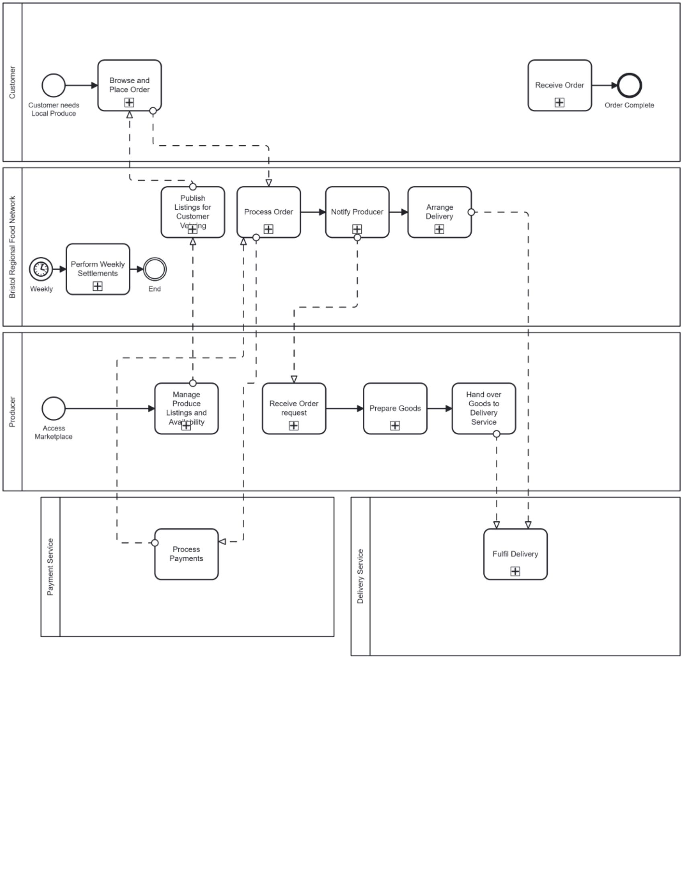
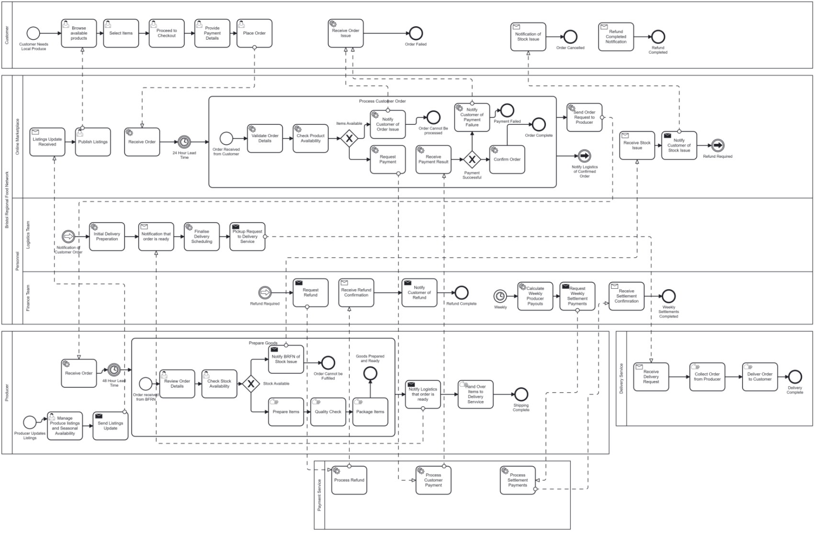

# DESD Project Documentation

## System Overview

This project implements a marketplace platform for the Bristol
Regional Food Network (BRFN). The system connects local producers
with customers through an online marketplace where producers can
list available produce and customers can browse and place orders.

The system design is based on business process models developed
during Term 1. These diagrams guided the architecture of the
Django application and helped identify the key actors and
interactions within the system.

## Business Process Models

### Strategic Process Diagram



### Operational Process Diagram



The strategic diagram outlines the core actors and process flows within the system. The operational diagram expands this into a detailed workflow including order processing, payment settlement, and delivery coordination.

---

## System Architecture

The application follows a **modular Django architecture** where different responsibilities are separated into dedicated apps.

### Core Applications

**accounts**

Handles authentication and the custom user model.  
Users can register as either **Customer** or **Producer**, enabling role-based access to system functionality.

**producers**

Manages producer profiles including business name, location, contact details, and producer-specific dashboard functionality.

**products**

Handles product listings including full **CRUD operations** (Create, Read, Update, Delete) for producers.  
Products include pricing, stock levels, category information, allergen data, and availability dates.

**marketplace**

Provides the main marketplace interface where customers can browse products and view available listings.

This modular design improves maintainability and keeps responsibilities clearly separated.


---

## Infrastructure and Containerisation

The project uses **Docker Compose** to provide a reproducible development environment.

Two containers are used:

### Web Container
Runs the Django application.

### Database Container
Runs a PostgreSQL database used by the Django ORM.


Configuration values such as database credentials are stored in a **.env file**, ensuring sensitive information is not committed to the repository.

An entrypoint script automatically runs database migrations when the container starts, ensuring the system can initialise correctly from a fresh clone.

---

## Database Design

The system uses Django’s ORM to manage database operations and
define the structure of the PostgreSQL database.

The main models represent users, producer profiles, and product
listings. Relationships between these models are defined using
Django fields such as `OneToOneField` and `ForeignKey`.

---

## Authentication and Authorisation

Authentication is implemented using Django's built-in authentication system with a **custom user model extending AbstractUser**.

Users select their role during registration:

**Customer**
- Browse products
- View marketplace listings

**Producer**
- Manage product listings
- Maintain producer profile
- Access producer dashboard

Access to views is protected using:

- `login_required`
- role-based permission checks

This ensures that producers can only modify their own product listings.

---

## Sprint 1 Implementation

Sprint 1 focused on establishing the **core system architecture and development environment**.

Implemented functionality includes:

- Custom user model with role selection
- Registration, login, and logout functionality
- Role-based redirects after login
- Producer dashboard displaying owned product listings
- Customer marketplace displaying available products
- Product CRUD operations for producers
- Producer profile creation and editing
- PostgreSQL database integration
- Docker-based containerised environment
- Environment variable configuration using `.env`
- Automatic database migrations during container startup

These features provide the foundation for further development in future sprints.

---

## Running the Project

### Prerequisites

-   Docker Desktop
-   Git

------------------------------------------------------------------------

### Setup Instructions

1.  **Clone the repository**

    ``` bash
    git clone https://github.com/calwjones/DESD.git
    cd DESD-Project
    ```

2.  **Create environment configuration file**

    ``` bash
    cp .env.example .env
    ```

3.  **Build and start the containers**

    ``` bash
    docker compose up --build
    ```


4.  **Access the application**

        http://localhost:8089

------------------------------------------------------------------------

### Useful Commands

**Stop containers**

``` bash
docker compose down
```

**Rebuild containers**

``` bash
docker compose up --build
```

**Run Django management commands**

``` bash
docker compose exec web python manage.py <command>
```

------------------------------------------------------------------------

### Clean Startup Verification

To verify the project runs from a fresh state:

``` bash
docker compose down -v
docker compose up --build
```

This removes existing volumes and ensures the application starts
correctly from a clean environment.

## Future Development

Future sprints will extend the system with additional features including:

- Order processing and shopping cart functionality
- Multi-vendor checkout system
- Payment integration using Stripe
- Delivery scheduling and logistics tracking
- Weekly producer settlement calculations
- Community features such as surplus produce discounts and food miles tracking

---

## Project Management

The project is managed using **Jira** following an agile sprint methodology.

Work is organised into **Epics, Tasks, and Sprints**, with progress tracked using status categories:

- To Do
- In Progress
- Done

Sprint planning is based on the requirements identified in the Term 1 analysis and process diagrams.

---

## Team Members

- Arran Bailey
- Charlie Rodway
- Callum Jones
- Lei Ye (Tommy)
